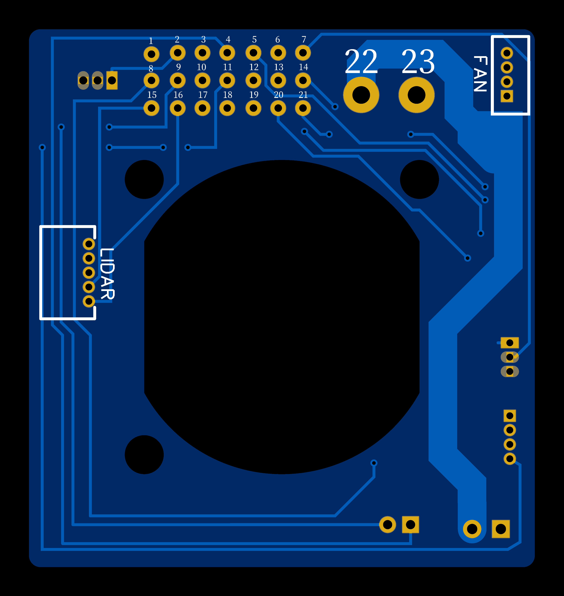

# Creality K1C toolhead board
Кастомная печатная плата головы (toolhead) для 3D-принтера **Creality K1C**.  
Проект ориентирован на модификации конструкции оригинального toolhead.

Плата идёт **без установленных электронных компонентов**.

---

## 📸 Рендер платы

*(Рендер печатной платы)*

---

## 🔍 Обзор

Этот репозиторий содержит полный набор файлов для самостоятельного изготовления и доработки toolhead board для Creality K1C.  
Проект подойдёт тем, кто хочет отказаться от платы с МК и драйвером или использовать её как основу для кастомных решений.

---

## 📦 Что есть в репозитории

- 🧾 **Gerber-файлы** — для заказа платы у производителя  
- 🧩 **PCB и схема в EasyEDA** — для просмотра и модификации  
- 🖼️ Рендеры платы  

---

## ⚙️ Особенности проекта

- 🟢 Только PCB (без компонентов)
- 🛠️ Готово к производству
- 🧪 Подходит для экспериментов и кастомизации
- 🔓 Полностью открытый проект

---

## ⚠️ Важная информация

Проект предоставляется **как есть**, без гарантий работоспособности.  
Использование, сборка и модификация платы выполняются на ваш риск.

---

## 📄 Лицензия

Проект распространяется под лицензией **GNU GPL v3**.  
Вы свободны использовать, изменять и распространять проект при соблюдении условий лицензии.
